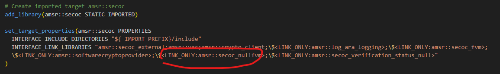

# SOK Mid linux RTE demo platform

## Maintenance
The RTE's conanfile.py requirements section should be updated according to the published DevDrops from Mid integration team
see https://devstack.vwgroup.com/confluence/display/E3MID/Devdrops for latest DevDrop

## Setup
follow this setup manual form Mid integration team
https://git.hub.vwgroup.com/swp-mid/vwos-mid-wiki/wiki/DevEnv-Setup

## How to build
under vwos-sok/scripts there is a convenience script for creating the Mid linux RTE platform
just execute
```shell
./scripts/build_sok_demo_rte.sh
```
and a `build` should be created if everything went smoothly containing the RTE

## How to run
run 
```shell
./build/scripts/run_docker.sh
```
stop
```shell
./build/scripts/stop_docker.sh
```

## Issus
https://devstack.vwgroup.com/jira/browse/BSWM-5759
this issue currently preventing ara::SecOC from loading our plugin FVM library

As a workaround in the file:

`~/.conan/data/vwos-mid-vector-amsr/1.3.0/vwos/integration/package/1ffcd4e69cae12ef9317b39461ab5f0d39a0b53b/lib/cmake/AMSR/AMSRStaticTargets.cmake`

remove this marked code:

and rerun the script
### Note for WSL2 users
* adding `--cpu-rt-runtime=950000` to the the `docker run` command in the `run_docker.sh` script
* some adaptation to the docker daemon is needed. see https://stackoverflow.com/a/70597953 answer that worked for me
